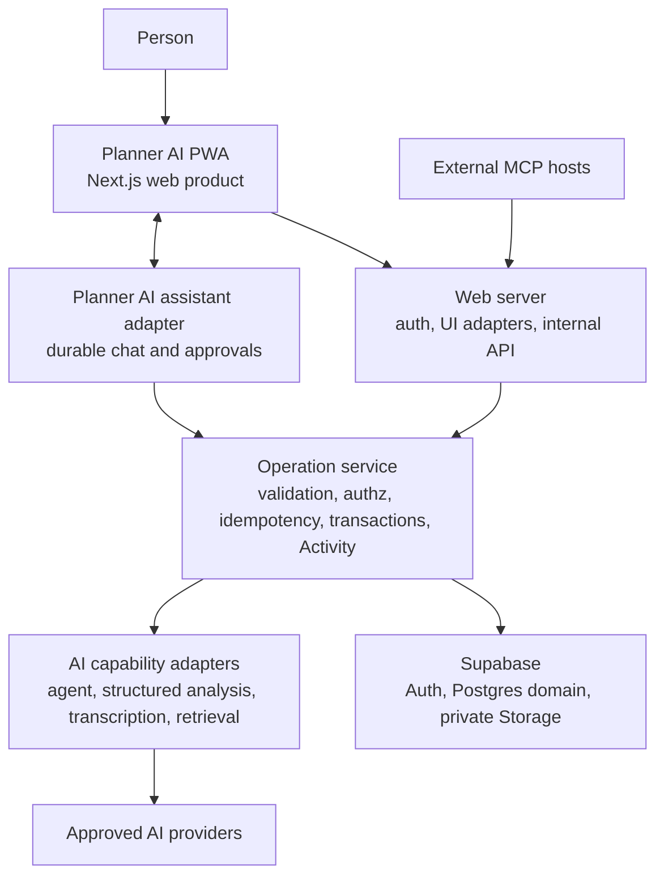

# Planner AI Target Architecture

Status: **Approved architecture authority.** See the [ADRs](../adr/README.md) for rationale and the [roadmap](../roadmap.md) for staged evolution.

## Architecture Goals

- Keep the click-first Planner AI Workspace usable without AI.
- Give UI, chat, voice, automations, and MCP one validated Operation surface.
- Keep Supabase authoritative for domain, Conversation, Proposal, Memory, and grant data in v1.
- Preserve user input, ownership, auditability, and recovery through partial failures.
- Support a small private beta without building collaboration, native mobile, local-first sync, or arbitrary agent code prematurely.

## System Shape

## Deployable Components

### 1. `web`: the product

The existing Next.js App Router application remains the only product shell. It owns Today, Plan, Notes, Review, Settings, authentication UX, onboarding, PWA behavior, and the embedded assistant container.

- Deploy to Vercel using Node.js 24 LTS.
- Server Components may read through authenticated repositories.
- Server Actions are thin UI adapters; they do not contain domain business logic.
- Route Handlers are used for protocol-shaped needs such as internal Operation HTTP, OAuth callbacks, streaming, and uploads.
- Browser code receives no service-role, database, provider, or integration secrets.

### 2. Operation service: the product authority

Operations are framework-neutral server modules with a stable ID and major version. Every request supplies an explicit `OperationContext`:

- verified actor and Workspace;
- surface: UI, chat, voice, automation, MCP, lifecycle job, or support;
- request and idempotency identifiers;
- risk class, grant, approval, Conversation/turn, and source metadata where relevant.

The service performs validation, authorization, optimistic concurrency, transaction handling, Activity, and stable error mapping. Multi-record writes are atomic. A successful response is returned only after the domain change and Activity receipt commit.

UI Server Actions, the internal agent endpoint, automations, and MCP call the same Operation implementation. They may have different grants but not different business rules.

### 3. Supabase: domain system of record

Supabase provides Auth, authoritative Postgres domain data, and private Storage.

- Domain rows are Workspace-scoped relational entities defined in the [canonical data model](data-model.md).
- RLS is defense in depth on every exposed table.
- Composite Workspace foreign keys prevent cross-owner relationships.
- A pooled, restricted, non-`BYPASSRLS` server database role supports transaction-capable Operations; the verified actor and Workspace are set transaction-locally and cleared automatically at commit or rollback. Ordinary user-scoped reads may use the verified Supabase JWT. Multi-record writes never simulate transactions with independent HTTP calls.
- The service-role credential is restricted to isolated lifecycle jobs such as final account purge and is never available to the agent runtime.
- Authenticated browser roles have no direct mutation grants on protected domain tables; an endpoint is not trusted merely because it runs server-side.
- Physical changes use reviewed Supabase CLI migrations. Historical prototype SQL is retained only in Git history and is not a migration source.

### 4. Agent capability adapter

The first release adapts Agent Native's useful action, context, approval, and protocol patterns without shipping its runtime. `web` owns durable Conversations, Proposals, explicit Memory, the docked assistant, and inbound MCP in the same authenticated product boundary.

- Generate assistant and MCP capabilities only from registered Planner AI Operations.
- Keep raw SQL, Supabase credentials, shell, repository, deployment, filesystem, secret management, generated extensions, and arbitrary outbound MCP absent.
- Reconsider a separate runtime only through ADR-0024's isolation and evidence gate.

The imported Agent Native application was retired after its useful patterns and feasibility evidence were captured. It remains available in Git history but is not a product, build, or deployment dependency.

### 5. AI capability adapters

Server-only adapters separate four roles:

- `agent`: conversational planning and tool selection;
- `structured-analysis`: Proposals, SMART review, and summaries;
- `transcription`: audio to raw text;
- `retrieval`: exact search first, embeddings later.

Each adapter declares provider/model version, timeout, retry policy, retention approval, cost ceiling, and fallback. Outputs are schema-validated. Provider failures create durable job status and never discard input or disable ordinary planning.

## Identity And Trust Boundaries

### Browser to web

Supabase Auth cookies are verified server-side. Proxy/middleware improves navigation behavior but is not the authorization boundary; every Server Action, Route Handler, repository, and Operation verifies identity and ownership independently.

### Browser to assistant

The dock uses the existing verified Supabase session. The server derives stable user and Workspace identity and never accepts browser-supplied ownership.

### Assistant to Operations

Interactive calls carry verified user, Conversation, Proposal, and turn metadata. Approved writes execute the persisted Proposal input through the Operation service. The model and browser receive no service-role authority.

### External MCP

External hosts connect to Planner AI's scoped MCP endpoint. RFC 9728 protected-resource metadata points clients to Supabase OAuth 2.1, which provides authorization code with PKCE, dynamic registration, and rotating refresh tokens. Planner AI's own AAL2 consent screen separately grants explicit versioned product Operations. Grants are revocable, rate-limited, and mapped to Activity. Scoped manual tokens remain a compatibility fallback; outbound third-party MCP remains a later gate.

## Data And Content Boundaries

- The assistant starts with route, selection, timezone, and explicit attachments.
- Additional context comes from authorized read Operations and honors AI Exclusion.
- Notes, imports, attachments, Calendar Events, webpages, model output, and MCP output are untrusted data, not instruction sources.
- Retrieved content cannot grant tools, alter approval policy, change destinations, or reveal secrets.
- Captures remain immutable; AI writes Proposals, never silent replacements.
- Conversations remain distinct from Notes, Captures, and explicit Memory and participate directly in export and deletion.

## Secrets

- Use platform environment secret storage for deployment credentials.
- Store OAuth refresh tokens and connection secrets in an encrypted server-side vault with a key outside its database.
- Bind each secret to provider, user/Workspace, allowed destination domains, scopes, and revocation state.
- Models, generated UI, browser code, logs, Activity, and analytics never receive raw secret values.
- Maintain separate development, preview, staging, and production credentials and databases.

## Reliability And Recovery

- Core Operation target: 99.5 percent monthly beta availability and p95 below 750 ms for ordinary requests.
- AI/transcription availability is measured separately.
- Operations use bounded timeouts, idempotency, retry classification, and circuit breaking.
- Unsent Captures persist locally; full offline editing remains deferred.
- Supabase Pro daily backups are supplemented by encrypted logical exports and separate Storage copies.
- Initial RPO is 24 hours and RTO is four hours, validated before external beta and quarterly thereafter.

## Observability

Operational telemetry is content-free: Operation ID/version, result, latency, stable error, provider class, token/cost totals, and pseudonymous Workspace. Product analytics is opt-in during beta. Activity is a separate user-visible record of important actions. Logs and analytics never contain Note/Capture/Memory/Conversation bodies, transcripts, prompts, filenames, tokens, or secrets.

## Testing Architecture

- **Unit:** Vitest for schemas, policies, state transitions, risk classification, and adapters.
- **Database integration:** local Supabase/Postgres migrations, RLS cross-user tests, constraints, and transactional Operation tests.
- **Browser:** Playwright for authenticated critical paths, responsive PWA, and UI/chat parity.
- **Accessibility:** automated axe checks plus manual keyboard and screen-reader verification.
- **AI evaluations:** versioned fixtures for structured correctness, evidence, refusal, injection resistance, fallback, and cost.
- **Contract:** every Operation version tested through UI/internal HTTP/agent/MCP adapters where exposed.
- **Recovery:** migration rollback, backup restore, and provider-outage drills.

## Toolchain And Repository Boundary

- Standardize production packages on Node.js 24 LTS and one pinned package manager during foundation work.
- Add CI before domain migration: lint, format, typecheck, unit, migration, RLS, build, dependency audit, and browser smoke tests.
- Keep generated Supabase types synchronized in CI.
- Keep production in `web` with reusable contract/test fixtures. Do not import the standalone Agent Native application UI.

## Migration Strategy

1. Secure current AI endpoints and capture a production schema/data baseline.
2. Back up and inventory existing rows and environment configuration.
3. Build canonical tables beside legacy tables through migrations.
4. Use a short maintenance window to transform data; avoid dual-write complexity for the small prototype.
5. Validate counts, ownership, links, text, dates, and rollback.
6. Switch behind a release flag and run the full critical path.
7. Keep legacy tables read-only for 30 days, then remove them separately.

## Explicit Non-Architecture

The following are not part of the first release:

- local-first or writable filesystem sync;
- Tauri, native iOS, or native Android clients;
- collaboration, shared Workspaces, teams, or public pages;
- generic custom hierarchies or database builders;
- production code execution, source modification, shell, or filesystem access;
- arbitrary generated extensions or arbitrary outbound MCP;
- full habit tracking, streaks, or gamification;
- live Notion sync or Calendar writes before the read-only integration is trusted.

## Gated Architecture Evolution

The first release deliberately uses a cloud-authoritative relational core. Future capabilities extend that core in stages rather than replacing it with a second application or source of truth.

### Structured workspace

Add typed collections, properties, relations, formulas, and saved view definitions over canonical Workspace objects. Views compile to authorized query plans; they do not expose arbitrary SQL or duplicate records per view. Graph and Canvas store typed edges and layout metadata that reference the same objects.

### Local-first

Do not equate a service worker or browser cache with local-first architecture. A true local-first phase requires a durable local database, an ordered mutation journal, stable device and actor identity, explicit sync checkpoints, deterministic merge semantics per field type, encryption and key recovery, schema migration across offline clients, attachment synchronization, and observable repair tooling. Supabase remains the coordination and shared-authority service until an ADR proves a replacement.

### Collaboration

Move from single-owner Workspace authorization to explicit memberships, roles, object grants, share links, comments, presence, and revocation only after RLS and Operation contracts model every permission. Real-time transport is an optimization; authorization and conflict resolution remain server-verifiable domain behavior.

### Extension platform

Extensions use signed manifests, declared capabilities, isolated execution, resource quotas, egress controls, version compatibility, review, revocation, and user-visible Activity. AI-generated extensions have no special authority and cannot bypass the same platform contract.

### Cost and latency controls

- Keep interactive reads and writes on bounded relational paths with measured p95 targets.
- Move transcription, indexing, import, export, and long AI analysis to durable jobs.
- Bound context, model calls, retries, fan-out, formula evaluation, graph traversal, subscriptions, and attachment processing per Workspace.
- Measure cost by capability and provider without logging content.
- Prefer reversible migrations, expand/contract schema changes, and compatibility windows for every external Operation version.
