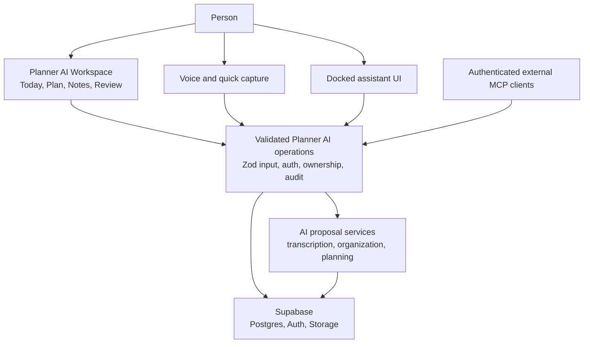

# Planner AI Implementation Roadmap

> **Implementation decision, 2026-08-16:** The PAI-501 feasibility spike concluded **adapt patterns; defer the runtime**. ADR-0024 supersedes the assumed first-release sidecar in ADR-0002 and ADR-0014. The production dock, durable Conversations/Proposals, approvals, explicit Memory, Activity, and inbound MCP now live in `web` and use the shared Operation registry. PAI-502 through PAI-510 remain capability and security acceptance criteria, but no separate Agent Native deployment is required for v1.

This is the canonical delivery plan. Architecture and product decisions are tracked in the [Planner AI Decision Register](planner_ai_decision_register.md), the approved entities are defined in the [canonical data model](database_schema.md), and repository risks are recorded in the [current-state audit](docs/current-state-audit.md). All pre-implementation decisions are closed; a new contradiction requires an ADR rather than an undocumented deviation.

## Decision Summary

The correct template name is **Content**. It is Agent Native's open-source, Obsidian-like document workspace, with hierarchical documents, rich editing, Markdown/MDX, search, history, and optional database views.

Planner AI should not merge the existing `web` MVP, the current Agent Native `planner` app, and Content as whole applications. That would create competing authentication, data, routing, and UI systems. Instead:

- Keep `web` as the only product shell and migrate its critical flows safely.
- Keep Supabase as the authoritative source of truth for the first legitimate release.
- Define one transport-neutral Planner AI Operation service that the interface, AI chat, voice processing, automations, and MCP clients all use.
- Treat the current `planner` app and SQL data as disposable integration scaffolding. Adapt reviewed patterns into `web`; do not ship a separate Agent Native runtime in the first release unless a future ADR proves a capability that the product shell cannot safely provide.
- Take selected Content capabilities for Notes. Do not copy its full application, local-file mode, or database system into Planner AI without a specific product need.

This keeps the click-first workspace primary and makes AI a trustworthy second way to perform the same operations.

The storage decision is recorded in [ADR-0001](docs/adr/0001-supabase-source-of-truth-for-first-release.md). Markdown export is a launch requirement; writable local-file mode and offline conflict resolution are not.

The product-shell decision began in [ADR-0002](docs/adr/0002-embed-agent-native-in-the-web-product.md) and is superseded for v1 by [ADR-0024](docs/adr/0024-adapt-agent-native-capabilities-without-shipping-its-runtime.md). The standalone `planner` app is not a product, sidecar, or migration destination.

The production authority boundary is recorded in [ADR-0003](docs/adr/0003-limit-production-agent-authority.md). Product Operations and developer capabilities use separate allowlists and credentials.

The approval model is recorded in [ADR-0004](docs/adr/0004-use-risk-based-agent-approvals.md). Every Operation is classified as immediate, reversible, consequential, or prohibited.

The ownership model is recorded in [ADR-0005](docs/adr/0005-use-single-owner-workspaces-for-first-release.md). First-release Workspaces are private and single-owner even though the platform supports multiple users.

Account security is recorded in [ADR-0011](docs/adr/0011-use-verified-authentication-and-step-up-mfa.md). Verified email/password and Google OAuth launch first, with TOTP step-up for sensitive account Operations.

Data protection and recovery are recorded in [ADR-0012](docs/adr/0012-protect-and-recover-user-data.md). The release uses transparent server-readable encryption boundaries, recoverable Trash, restricted private attachments, and tested database and Storage recovery.

The reliability boundary is recorded in [ADR-0013](docs/adr/0013-keep-the-core-reliable-without-ai.md). Core planning has its own service objective, survives AI-provider incidents, and emits content-free telemetry.

The discarded sidecar's framework-state isolation is retained as historical context in [ADR-0014](docs/adr/0014-isolate-agent-native-framework-state.md); ADR-0024 controls v1. The free staged-beta boundary is recorded in [ADR-0015](docs/adr/0015-stage-beta-before-billing.md).

Assistant context, Conversation lifecycle, and evidence are recorded in [ADR-0016](docs/adr/0016-minimize-assistant-context-and-require-evidence.md). Turns use minimal context, honor AI Exclusions, and cite exact sources without treating chat as Memory.

Provider privacy, managed credentials, and cost controls are recorded in [ADR-0017](docs/adr/0017-govern-ai-providers-and-managed-credentials.md). Calendar semantics are recorded in [ADR-0018](docs/adr/0018-separate-actions-from-calendar-events.md), the PWA-first mobile strategy in [ADR-0019](docs/adr/0019-ship-a-pwa-before-native-mobile.md), and external Operation compatibility in [ADR-0020](docs/adr/0020-version-exposed-operation-contracts.md).

The relational domain and transport-neutral Operation service are fixed by [ADR-0021](docs/adr/0021-use-a-relational-domain-and-operation-service.md). Production extensibility, untrusted content, and outbound MCP are gated by [ADR-0022](docs/adr/0022-stage-agent-extensibility-behind-security-gates.md). Support access and user-visible Activity are fixed by [ADR-0023](docs/adr/0023-restrict-support-access-and-expose-activity.md).

## Feature Completeness Contract

Every new capability ships as one shared Planner AI Operation. In code, Agent Native may expose that Operation with `defineAction`, but product documentation uses **Operation** so it is not confused with a planning **Action**.

A feature is complete only when:

1. Its input and output contracts are typed and validated.
2. Authentication, ownership, and authorization are enforced server-side.
3. The click-first UI calls the Operation instead of duplicating business logic.
4. The assistant can discover and call it with useful descriptions and current-page context.
5. Its risk class and undo strategy determine whether it runs immediately, executes with undo, requires preview and confirmation, or is prohibited.
6. MCP and automation exposure are explicitly allowed, restricted, or denied.
7. Audit, error, and parity tests cover the UI and agent paths.
8. Exposed contracts have stable identifiers, explicit versions, and a tested compatibility or migration path.

Production Operations must never grant the assistant or an MCP client repository access, deployment control, shell execution, infrastructure secret access, authentication-policy control, or Supabase service-role authority.

## Confirmed Domain Model

- **Vision** expresses long-term direction and is not a Goal.
- **Goals** describe outcomes and belong to yearly or quarterly Planning Horizons.
- **Actions** describe completable work and belong to monthly or weekly Planning Horizons.
- A **Planning Horizon** is a time boundary, not a content type or hierarchy tier.
- The **Plan** connects Vision, Goals, Actions, and Planning Horizons.
- An **Attachment** is a private file associated with a Note and follows that Note's ownership and lifecycle.
- **Trash** is a 30-day recoverable deletion state, not an archive or backup.
- A **Conversation** is durable interaction history, not a Note, Capture, or Memory.
- An **AI Exclusion** prevents assistant processing of a Note unless the person explicitly includes it for one interaction.
- A **Calendar Event** reserves external time and may link to an Action without becoming or completing that Action.
- An **Operation** is a transport-neutral product capability and is not a planning Action.

The canonical model is implemented in versioned `web/supabase/migrations`, but it has not been applied to the owned remote project. The running app therefore remains in legacy mode until backup, migration, pgTAP, and cutover checks pass. The imported `planner` reference still uses an unrestricted tiered node model and remains outside production architecture.

## Current Starting Point

| Area          | Current State                                                                                                                                                                                                                                                                                                                                                                                                                                                                                                                                                                                                                                                                                                                                                                                                                                                                                                                                                                                                                                                                                                                                                                                                                                                                                                                                                              | Needed Direction                                                                                                                                                                                                                                |
| ------------- | -------------------------------------------------------------------------------------------------------------------------------------------------------------------------------------------------------------------------------------------------------------------------------------------------------------------------------------------------------------------------------------------------------------------------------------------------------------------------------------------------------------------------------------------------------------------------------------------------------------------------------------------------------------------------------------------------------------------------------------------------------------------------------------------------------------------------------------------------------------------------------------------------------------------------------------------------------------------------------------------------------------------------------------------------------------------------------------------------------------------------------------------------------------------------------------------------------------------------------------------------------------------------------------------------------------------------------------------------------------------------- | ----------------------------------------------------------------------------------------------------------------------------------------------------------------------------------------------------------------------------------------------- |
| Product UI    | `web` has the responsive Workspace shell, Today, Plan, simple recurring Actions, Notes, Notifications, Review, Capture, Activity, Trash, settings, state-aware coaching cues, and skippable guided onboarding.                                                                                                                                                                                                                                                                                                                                                                                                                                                                                                                                                                                                                                                                                                                                                                                                                                                                                                                                                                                                                                                                                                                                                             | Complete authenticated critical-path, accessibility, error-state, and recovery testing before beta.                                                                                                                                             |
| Data and auth | Supabase is live; the canonical schema, forced RLS, protected Operations, recovery, export, and lifecycle migrations exist locally.                                                                                                                                                                                                                                                                                                                                                                                                                                                                                                                                                                                                                                                                                                                                                                                                                                                                                                                                                                                                                                                                                                                                                                                                                                        | Back up first; run migrations and pgTAP remotely, regenerate types, cut over from legacy mode, and configure production email delivery.                                                                                                         |
| AI            | Provider routes are authenticated, schema-bounded, quota-controlled, usage-accounted, budget-visible, and connected to durable proposals and shared Operations. The prompt boundary independently minimizes context and removes AI-excluded Notes. A maintained fourteen-case assistant corpus and six-case Capture/Review corpus use shared production prompt builders and deterministic evaluators to cover authority, prompt injection, evidence, output contracts, exact Operation selection, ambiguous-input restraint, weekly priority selection, non-weekly priority exclusion, recurring Action control, notification control, and Capture Proposal approval. The compact Operation catalog has a tested provider-budget ceiling. Role-based provider clients have explicit timeouts and bounded retries. All 50 contracts classified as reversible have conflict-safe, receipt-backed Undo in Activity and assistant surfaces. Multi-record Review, archive, import, Trash, onboarding, recurring materialization, notification refresh, Conversation lifecycle, Capture Proposal edits/dismissal, and account-deletion scheduling reversals retain exact snapshots and refuse stale dependencies. Weekly Review retains append-only schedule evidence, Trash restores Today focus, and account-deletion cancellation never silently restores external authority. | Require the live gate for every model/prompt/catalog/provider change, run the database suites on the owned Supabase project, expand adversarial coverage with each new input/tool boundary, and complete authenticated canonical journey tests. |
| Agent Native  | The feasibility spike is complete; `planner` is a reference with a conflicting data model.                                                                                                                                                                                                                                                                                                                                                                                                                                                                                                                                                                                                                                                                                                                                                                                                                                                                                                                                                                                                                                                                                                                                                                                                                                                                                 | Keep one `web` runtime and preserve capability parity through the shared Operation registry.                                                                                                                                                    |
| Notes         | A Markdown vault now provides hierarchy, search, tags, typed links/backlinks, Goal/Action relations, revisions, AI Exclusion, Capture filing, and review-before-commit Notion/Obsidian import.                                                                                                                                                                                                                                                                                                                                                                                                                                                                                                                                                                                                                                                                                                                                                                                                                                                                                                                                                                                                                                                                                                                                                                             | Add restricted private attachments only after Storage, malware quarantine, export, deletion, backup, and restore controls exist; complete authenticated browser coverage.                                                                       |
| Quality       | CI, lint, typecheck, unit, build, browser boundaries, database tests, dependency review, and secret scanning exist.                                                                                                                                                                                                                                                                                                                                                                                                                                                                                                                                                                                                                                                                                                                                                                                                                                                                                                                                                                                                                                                                                                                                                                                                                                                        | Run database and recovery suites against real infrastructure; expand authenticated critical-path, accessibility, and abuse coverage.                                                                                                            |

## Target Architecture

Rules for this architecture:

1. The AI and MCP layers never receive raw database access.
2. Every operation checks the signed-in user and object ownership server-side.
3. AI generates proposals first. A person approves destructive or meaningful changes.
4. Raw voice text and original user writing are retained separately from AI summaries.
5. Every meaningful write creates an audit record and supports reversal where practical.
6. Core UI Operations remain available when AI and transcription providers fail.
7. No Agent Native framework state or second application database ships in the first release.
8. Imported text, web content, attachments, and MCP responses are untrusted data and never grant authority.
9. Production code execution, arbitrary extensions, repository access, and shell access are disabled.

## Operation Risk Classes

| Class         | Behavior                                                           | Typical Examples                                                                                             |
| ------------- | ------------------------------------------------------------------ | ------------------------------------------------------------------------------------------------------------ |
| Immediate     | Runs without confirmation.                                         | Read, search, summarize, analyze, explain, preview.                                                          |
| Reversible    | Runs immediately and shows an undo affordance.                     | Create a Note, add an Action, rename, save a Capture, mark complete.                                         |
| Consequential | Shows exact affected records/effects and requires confirmation.    | Archive a Goal subtree, bulk rewrite, delete, share/export, create automation, call an external integration. |
| Prohibited    | Not available to the production assistant or external MCP clients. | Source edits, shell, deployment, infrastructure secrets, auth policy, service-role access.                   |

## Delivery Gates

| Gate                 | Outcome                                                      | Required Before Moving On                                                                                                                                                               |
| -------------------- | ------------------------------------------------------------ | --------------------------------------------------------------------------------------------------------------------------------------------------------------------------------------- |
| G0: Foundation       | A stable, testable core product.                             | Verified email/password and Google auth work, data schema is documented, RLS is enforced, and core tests run in CI.                                                                     |
| G1: Workspace        | Today, Plan, Notes, and Review work without AI.              | A user can complete daily planning and review through a responsive installable PWA that meets WCAG 2.2 AA.                                                                              |
| G2: Intelligence     | AI proposes useful organization and planning.                | Providers pass privacy review; context is minimal; sources and inference are visible; AI cannot lose data, bypass permissions, or make unapproved high-impact changes.                  |
| G3: Agent Native     | Docked chat performs the same approved Operations as the UI. | Operation parity, context checks, approvals, audit log, and failure handling pass.                                                                                                      |
| G4: External MCP     | External tools can use a small, safe Planner AI surface.     | Token scopes, revocation, rate limits, audit trails, allowlists, and versioned compatibility are verified.                                                                              |
| G5: Launch Readiness | A dependable first release.                                  | Step-up MFA, skippable onboarding, privacy controls, import/export, Trash/deletion, database and Storage recovery, reliability targets, security review, and staged-beta criteria pass. |

Gate ownership by ticket:

| Gate | Required Ticket Groups                                                                         |
| ---- | ---------------------------------------------------------------------------------------------- |
| G0   | PAI-000 through PAI-009; PAI-301 through PAI-307; PAI-501 and PAI-509 feasibility evidence.    |
| G1   | PAI-101 through PAI-112; PAI-201 through PAI-206 and PAI-211.                                  |
| G2   | PAI-401 through PAI-413.                                                                       |
| G3   | PAI-501 through PAI-510.                                                                       |
| G4   | PAI-601 through PAI-606. PAI-607 remains post-beta.                                            |
| G5   | PAI-207 through PAI-210 and PAI-701 through PAI-709, including every transitive P0 dependency. |

## Ticket Backlog

### Workstream A: Product And Platform Foundation

| ID      | Ticket                                                                      | Priority | Depends On                | Done When                                                                                                                                                                                                                                                                                                                                                                   |
| ------- | --------------------------------------------------------------------------- | -------- | ------------------------- | --------------------------------------------------------------------------------------------------------------------------------------------------------------------------------------------------------------------------------------------------------------------------------------------------------------------------------------------------------------------------- |
| PAI-000 | Contain and baseline the current prototype.                                 | P0       | None                      | Remote schema and data are backed up; current counts and environment names are recorded; every AI route requires an authenticated user, bounded schema-valid input, request/media limits, distributed per-user quotas, safe errors, and content-free logs; unused AI endpoints are disabled; secrets are confirmed outside Git; invite gating prevents uncontrolled signup. |
| PAI-001 | Ratify the canonical model and map prototype data.                          | P0       | PAI-000                   | `database_schema.md` is reviewed against actual remote tables; every prototype table/column maps to a target entity or an explicit discard; constraints, lifecycle, timezone, outcome metrics, verification queries, cutover, and rollback are documented.                                                                                                                  |
| PAI-002 | Implement and prove Supabase ownership boundaries.                          | P0       | PAI-001                   | Every domain table has Workspace-scoped composite foreign keys and explicit RLS `USING` and `WITH CHECK`; browser clients cannot bypass Operations for protected writes; cross-user and cross-Workspace tests fail closed; service-role use is limited to named lifecycle jobs.                                                                                             |
| PAI-003 | Replace built-in Supabase auth email with custom SMTP.                      | P0       | Supabase dashboard access | Signup, verification, and password reset use a verified sender domain and acceptable rate limits.                                                                                                                                                                                                                                                                           |
| PAI-004 | Establish repeatable Supabase migrations and cutover tooling.               | P0       | PAI-001                   | Supabase CLI migrations create a fresh canonical database and deterministic test fixtures; remote drift is detected; prototype data migrates during a documented maintenance window with preflight counts, validation, rollback, and no dual-write period or manual dashboard SQL.                                                                                          |
| PAI-005 | Add error tracking, structured server logs, and a privacy-safe event model. | P1       | PAI-002                   | Failures can be diagnosed using Operation, result, latency, error, provider class, cost totals, and pseudonymous identity without logging personal content, filenames, prompts, session replay, or keys; raw events expire after 90 days.                                                                                                                                   |
| PAI-006 | Establish CI quality and supply-chain gates.                                | P0       | PAI-004                   | Pinned Node.js and package-manager versions run format, lint, typecheck, build, unit, database/RLS, and Playwright smoke tests; dependency review, secret scanning, migration drift, and generated Supabase-type drift fail the build.                                                                                                                                      |
| PAI-007 | Complete invite-gated authentication and Google OAuth.                      | P0       | PAI-003                   | Verified email/password with a strong breached-password-aware policy, callback and reset completion, Google sign-in, safe verified-email linking, logout, invite enforcement, and duplicate/account-enumeration cases pass.                                                                                                                                                 |
| PAI-008 | Add TOTP MFA and sensitive-operation step-up.                               | P0       | PAI-007                   | Users can enroll, verify, add a backup factor, and remove TOTP safely; identity changes, offline MCP grants, full export, and account deletion require a recent `aal2` session.                                                                                                                                                                                             |
| PAI-009 | Document and enforce the encryption and AI-processing boundary.             | P0       | PAI-002                   | TLS, private Storage, least-privilege server access, application-level provider-secret encryption, AI data routing, and user-facing privacy language are verified; the product makes no E2EE claim.                                                                                                                                                                         |

### Workstream B: Finish The Click-First Workspace

| ID      | Ticket                                                    | Priority | Depends On                         | Done When                                                                                                                                                                                                                                                                                                                                         |
| ------- | --------------------------------------------------------- | -------- | ---------------------------------- | ------------------------------------------------------------------------------------------------------------------------------------------------------------------------------------------------------------------------------------------------------------------------------------------------------------------------------------------------- |
| PAI-101 | Complete the Today page and focus contract.               | P0       | PAI-001                            | It shows outcome-aware Goal Progress, recent Captures, overdue work, at most three highlighted daily priorities, and a deliberate replacement flow when the focus set is full.                                                                                                                                                                    |
| PAI-102 | Complete the Plan workspace.                              | P0       | PAI-001                            | A user can connect Vision to yearly/quarterly Goals and monthly/weekly Actions, with complete edit, archive, restore, loading, and empty states.                                                                                                                                                                                                  |
| PAI-103 | Make Actions first-class and schedulable.                 | P0       | PAI-001                            | Actions can be linked to a Goal or Note, scheduled into a monthly or weekly Planning Horizon, completed, moved, and reviewed.                                                                                                                                                                                                                     |
| PAI-104 | Build Weekly, Monthly, and Quarterly Review workflows.    | P0       | PAI-101, PAI-103                   | Weekly Review resolves every unfinished Action without silent rollover, preserves scheduling history, and commits at most five weekly priorities; optional Monthly and Quarterly templates summarize lower horizons.                                                                                                                              |
| PAI-105 | Add dependable Capture Inbox and audio lifecycle.         | P0       | PAI-001                            | Typed and voice input create immutable raw Captures with exact original text and `new`, `proposed`, `reviewed`, and `archived` states; generic normalization never rewrites the source; successful audio is deleted, failed audio is durably encrypted outside browser memory and expires within seven days, and retry/delete states are visible. |
| PAI-106 | Meet WCAG 2.2 AA across core workflows.                   | P0       | PAI-101 through PAI-105            | Automated CI plus manual keyboard and screen-reader checks cover focus, names, announcements, contrast, zoom/reflow, reduced motion, target size, authentication, errors, and alternatives to drag or voice on desktop and mobile.                                                                                                                |
| PAI-107 | Add offline-safe mobile Capture queue.                    | P0       | PAI-105                            | Unsent typed and voice Captures survive reload and network loss, retry idempotently, show sync state, and never duplicate; offline Plan and Note editing remain unavailable.                                                                                                                                                                      |
| PAI-108 | Add simple recurring Action templates.                    | P1       | PAI-103                            | Weekly or monthly templates create ordinary dated Actions idempotently; each occurrence has independent status/history, while streaks and complex recurrence remain absent.                                                                                                                                                                       |
| PAI-109 | Add coaching intensity and decision-point suggestions.    | P1       | PAI-101, PAI-104, PAI-402          | Users choose calm, direct, or strict coaching; proactive suggestions appear in Today, Inbox, and Review without interrupting ordinary editing.                                                                                                                                                                                                    |
| PAI-110 | Add in-app notifications and scheduled email preferences. | P1       | PAI-003, PAI-104                   | Users can inspect, dismiss, and configure in-app notifications, email reminders, timezone, and quiet hours; push and messaging channels remain disabled.                                                                                                                                                                                          |
| PAI-111 | Ship the responsive installable PWA.                      | P0       | PAI-106, PAI-107                   | Planner AI installs on supported mobile and desktop browsers, uses one authenticated product and Operation layer, supports touch and voice Capture, recovers unsent input, and passes mobile navigation and update tests without native wrappers.                                                                                                 |
| PAI-112 | Build skippable first-run onboarding.                     | P0       | PAI-007, PAI-101, PAI-103, PAI-105 | A new user can confirm time settings and privacy choices, optionally draft a Vision, create one Goal and Action, make one typed or voice Capture, schedule Weekly Review, branch to import, skip any step, and enter an empty Workspace.                                                                                                          |

Implementation evidence on 2026-08-17: PAI-108, PAI-109, and PAI-110 are implemented locally. Recurring templates create ordinary Actions through shared Operations; calm/direct/strict decision cues appear without blocking editing; and owner-scoped in-app notifications plus count-only email preferences honor Workspace timezone and quiet hours. Notification email delivery remains disabled until migration, sender verification, and scheduler configuration pass in owned infrastructure.

### Workstream C: Notes Vault, Inspired By Content

| ID      | Ticket                                                   | Priority | Depends On                | Done When                                                                                                                                                                                                                                  |
| ------- | -------------------------------------------------------- | -------- | ------------------------- | ------------------------------------------------------------------------------------------------------------------------------------------------------------------------------------------------------------------------------------------ |
| PAI-201 | Define the Notes domain model.                           | P0       | PAI-001                   | Notes support title, Markdown/rich content, parent, sort order, archive state, timestamps, owner, and links to Goals or Actions.                                                                                                           |
| PAI-202 | Build hierarchical Note navigation and tags.             | P0       | PAI-201                   | A user can create, rename, move, nest, tag, archive, and restore Notes without losing content; the UI is optimized for six levels and warns rather than corrupting deeper trees.                                                           |
| PAI-203 | Add a focused Markdown-canonical editor.                 | P0       | PAI-201                   | Editing autosaves normalized Markdown, survives interruption, and round-trips headings, emphasis, lists, checklists, quotes, links, code blocks, dividers, tables, and internal Note links.                                                |
| PAI-204 | Add note links, backlinks, and planning relations.       | P1       | PAI-202, PAI-103          | A user can connect notes to Goals, Actions, and other notes and see those relationships.                                                                                                                                                   |
| PAI-205 | Add exact full-text search and Capture-to-Note workflow. | P0       | PAI-202, PAI-105          | Per-user Postgres search supports type, Goal, horizon, tag, and date filters and always links to exact source records; reviewed Captures can be filed into a Note.                                                                         |
| PAI-206 | Add revisions and restore for notes.                     | P1       | PAI-203                   | Users can inspect and restore prior note versions.                                                                                                                                                                                         |
| PAI-207 | Run a Content feature-adoption spike.                    | P1       | PAI-201                   | Document which Content editor, hierarchy, search, and history pieces can reuse Supabase-backed Planner AI operations without adding SQL or local-file stores.                                                                              |
| PAI-208 | Enforce the first-release Notes boundary.                | P1       | PAI-207                   | Executable MDX, arbitrary components, document databases, comments, publishing, collaboration, writable local files, and external sync are absent or feature-gated with no accidental dependency.                                          |
| PAI-209 | Build dry-run Notion and Obsidian import.                | P0       | PAI-201, PAI-202, PAI-203 | Markdown/CSV exports, folders, and ZIP files produce a reviewable hierarchy, unsupported-content report, duplicate plan, record counts, and resumable import without changing source files.                                                |
| PAI-210 | Add restricted private Note attachments.                 | P0       | PAI-203, PAI-009          | Images, PDF, text, Markdown, and CSV up to 25 MB are type-checked, quarantined until malware checks pass, stored owner-scoped, served through authorized or short-lived access, and included in export, Trash, deletion, and backup tests. |
| PAI-211 | Add per-Note AI Exclusion.                               | P0       | PAI-203, PAI-304          | Users can exclude or re-include a Note, see the boundary in UI and audit history, and explicitly attach an excluded Note for one interaction without making it broadly retrievable by chat, automation, or external MCP.                   |

### Workstream D: Shared Planner AI Operation Layer

| ID      | Ticket                                                   | Priority | Depends On       | Done When                                                                                                                                                                                                                                                          |
| ------- | -------------------------------------------------------- | -------- | ---------------- | ------------------------------------------------------------------------------------------------------------------------------------------------------------------------------------------------------------------------------------------------------------------ |
| PAI-301 | Build the transport-neutral Operation service.           | P0       | PAI-002          | Existing Vision, Goal, Action, and Capture capabilities run through framework-independent handlers with a typed `OperationContext`, Zod input/output contracts, authorization, stable errors, and no dependency on React, HTTP, Agent Native, or MCP transports.   |
| PAI-302 | Move existing UI writes onto the operation layer.        | P0       | PAI-301          | The interface no longer has separate business logic paths for the same persistent change.                                                                                                                                                                          |
| PAI-303 | Add transactions, idempotency, concurrency, and undo.    | P0       | PAI-301          | Every multi-record write is atomic; idempotency receipts prevent duplicate effects; expected-version checks reject lost updates; each reversible Operation has a tested inverse or restore path.                                                                   |
| PAI-304 | Add immutable audit records and user-visible Activity.   | P0       | PAI-301, PAI-303 | Important reads and durable changes record actor, surface, target metadata, timestamp, risk, approval, and outcome without duplicating content or secrets; each user can inspect and filter their Activity while security-only metadata remains access-controlled. |
| PAI-305 | Create Operation contract and isolation tests.           | P0       | PAI-301, PAI-303 | Validation, authorization, RLS, cross-user isolation, transaction rollback, idempotent retry, concurrency conflict, stable errors, risk metadata, and happy paths have automated coverage at the service boundary.                                                 |
| PAI-306 | Implement shared Trash and permanent-deletion semantics. | P0       | PAI-301          | Delete Operations preserve relationships in 30-day Trash, restore precisely, preview Empty Trash, and permanently remove expired or confirmed records idempotently with an audit trail.                                                                            |
| PAI-307 | Create the versioned Operation contract registry.        | P0       | PAI-301          | Every exposed Operation has a stable semantic ID, major schema version, risk and exposure metadata, generated machine description, compatibility tests, deprecation state, and migration path shared by UI, chat, automation, and MCP.                             |

### Workstream E: Safe AI Workflows

| ID      | Ticket                                                            | Priority | Depends On                | Done When                                                                                                                                                                                                                                                                                             |
| ------- | ----------------------------------------------------------------- | -------- | ------------------------- | ----------------------------------------------------------------------------------------------------------------------------------------------------------------------------------------------------------------------------------------------------------------------------------------------------- |
| PAI-401 | Define AI input, output, and proposal schemas.                    | P0       | PAI-301                   | AI outputs are structured, validated, versioned, and rejected when invalid.                                                                                                                                                                                                                           |
| PAI-402 | Build Capture organization Proposals.                             | P0       | PAI-105, PAI-401          | An immutable Capture can produce a versioned Proposal containing zero or more suggested Actions, Note edits, Goal links, tags, blockers, or reflections with model/prompt provenance.                                                                                                                 |
| PAI-403 | Add a Proposal review and approval queue.                         | P0       | PAI-402                   | Users compare a Proposal with its source, edit it, apply exact risk-classified Operations, dismiss it, or reprocess without changing the Capture.                                                                                                                                                     |
| PAI-404 | Add weekly planning and review proposals.                         | P1       | PAI-104, PAI-401          | The system can propose priorities and reflection prompts from the user's own data with clear citations/links.                                                                                                                                                                                         |
| PAI-405 | Add AI evaluation fixtures and regression tests.                  | P1       | PAI-401                   | Known capture and planning examples are scored for correctness, safety, and usefulness before model/prompt changes ship.                                                                                                                                                                              |
| PAI-406 | Add role-based AI provider adapters, fallback, and cost controls. | P0       | PAI-401, PAI-405          | Agent, structured-analysis, transcription, and embedding/search roles have versioned adapters; evaluated defaults and an agent-critical fallback handle timeouts, budgets, and provider outages.                                                                                                      |
| PAI-407 | Add explicit personal Memory.                                     | P1       | PAI-401, PAI-304          | Users can inspect, edit, delete, and undo Memory; the assistant proposes durable updates with sources and never silently promotes all content into Memory.                                                                                                                                            |
| PAI-408 | Implement tested AI-provider degradation.                         | P0       | PAI-406, PAI-107          | Provider timeouts preserve source input, expose job status and retry, use only evaluated fallbacks, and never disable click-first planning, Notes, exact search, or raw Capture creation.                                                                                                             |
| PAI-409 | Implement minimal assistant context and scoped retrieval.         | P0       | PAI-301, PAI-211          | Turns begin with route, selection, timezone, and explicit attachments; additional data comes through owner-scoped read Operations, honors AI Exclusions, records sources, supports temporary Conversation scope, and never dumps the whole vault or screen by default.                                |
| PAI-410 | Build durable user-controlled Conversations.                      | P0       | PAI-304, PAI-409, PAI-509 | Users can resume, rename, archive, search, export, and delete Conversations; deletion removes content-bearing messages/tool results, and promotion into Note, Capture, or Memory is always explicit.                                                                                                  |
| PAI-411 | Add evidence-linked AI output.                                    | P0       | PAI-401, PAI-409          | Proposals, recommendations, and summaries link exact product or external sources, label claims supported/inferred/needs-input, explain affected records before writes, and expose neither chain-of-thought nor raw internal prompts.                                                                  |
| PAI-412 | Govern providers, managed credentials, and AI budgets.            | P0       | PAI-005, PAI-406          | Every production provider/feature has an approved privacy register entry; beta uses server-managed credentials, reduced retention where compatible, visible Workspace usage, soft budgets, per-Operation limits, rate limits, a hard platform cap, and confirmation for unusually expensive analysis. |
| PAI-413 | Defend every AI boundary against untrusted content.               | P0       | PAI-401, PAI-409          | Imported Notes, attachments, websites, calendar text, and MCP responses are labeled as data; tools use allowlists and least privilege; indirect prompt-injection, data-exfiltration, cross-Workspace, malicious-file, and tool-confusion fixtures fail safely without relying on prompt text alone.   |

Implementation evidence on 2026-08-17: PAI-410 is implemented locally behind the canonical data-model gate. A dedicated history surface supports bounded title/transcript search, resume, rename, archive/restore, per-Conversation JSON export, exact-confirmation hard deletion, and explicit promotion to Note, Inbox Capture, or Memory. Rename and status changes use versioned shared Operations with receipt-backed Undo and MCP exposure; permanent deletion is high-risk, non-reversible, excluded from MCP, and cascades through content-bearing Messages and Proposals. The assistant receives only bounded Conversation metadata, refuses new turns in archived Conversations, and clears stale deep links after archive or deletion. The migration and 31-assertion pgTAP suite still require execution on the owned Supabase project before canonical cutover.

Implementation evidence on 2026-08-17: PAI-402 and PAI-403 are implemented locally behind the canonical data-model gate. Immutable Captures can produce versioned zero-to-ten-item Proposal batches with bounded blocker/reflection insights, model/prompt provenance, and a narrow allowlist of schema-validated shared Operations. The Inbox compares source, insights, risks, effects, and provenance; supports meaningful field edits, dismissal, and reprocessing; and requires a two-step explicit apply. Reprocessing supersedes only pending batches transactionally. Apply executes every item through the shared dispatcher in one database transaction, preserves item receipts, and rolls the entire batch back on one failure. Editing and dismissal have conflict-safe Undo; batch apply is non-reversible and excluded from MCP. The private persistence path, dedicated quota/accounting category, 44-assertion pgTAP suite, and thirteenth assistant fixture still require remote database and live-provider execution before canonical cutover.

Implementation evidence on 2026-08-17: PAI-408 is implemented locally for the current provider-backed surfaces. Provider throttling, timeout, outage, malformed-output, user-quota, and privacy failures map to distinct stable responses without provider detail leakage; retry timing is explicit where applicable. Assistant retries preserve and deduplicate the exact failed message, Socratic retries preserve the Vision draft, failed voice remains encrypted locally for retry, and Capture analysis retains immutable source plus a content-free durable running/succeeded/failed job ledger. Stale interrupted jobs become retryable, and a database freshness lock prevents an older timed-out analysis from publishing over a newer retry. Click-first planning, Notes, exact search, and raw Capture remain independent of provider availability. No unevaluated model fallback is configured; degradation returns to the ordinary product UI. The 21-assertion job pgTAP suite still requires execution on the owned Supabase project.

Implementation evidence on 2026-08-21: PAI-411 is implemented locally behind the canonical data-model gate. The current `assistant-v11` prompt requires concise claim records labeled `supported`, `inferred`, or `needs_input`; supported claims require one-to-four exact records from the bounded evidence catalog, needs-input claims cannot imply evidentiary support, and invented or duplicate references reject the entire provider response before persistence. Claim labels and references persist atomically with each assistant Message, while display labels and links are rebuilt from owner-scoped records and rendered beside the individual claim. Proposal summaries must name the affected record and exact effect before approval. The prompt and deterministic contract forbid chain-of-thought, raw prompts, and raw context disclosure. A provider-compatible response schema separates read tools from chat-exposed Proposals before strict application validation. A dedicated 14-assertion pgTAP suite still requires execution on the owned Supabase project, and the final full version-11 live provider rerun remains required after the daily quota reset.

Implementation evidence on 2026-08-17: PAI-412 is implemented locally behind the canonical data-model gate. Every current AI capability is listed in the provider register with its role, bounded input, completion ceiling, retention boundary, and confirmation rule; credentials remain server-managed. The Workspace dashboard now includes all six capabilities, soft-budget status, current-month reliability, latency, units, and price-versioned estimates. Canonical quota decisions distinguish per-minute throttling from the fixed monthly cap. Content-free, request-idempotent in-flight cost reservations close the concurrent-request cap window and expire after 15 minutes if a worker disappears. Text completions have explicit output ceilings, and Capture analysis over 12,000 characters requires a second explicit click before quota consumption or job creation. The 21-assertion governance pgTAP suite still requires execution on the owned Supabase project; Groq ZDR, billing limits, and production model permissions remain external release gates.

Implementation evidence on 2026-08-21: PAI-413 is enforced for every current text-provider surface. Assistant context, evidence catalogs, Goal drafts, Vision drafts, immutable Captures, and Capture record metadata cross the model boundary in a shared JSON envelope with fixed `authority: data_only`, explicit provenance, and payload nesting that hostile fields cannot override. This supplements rather than replaces the independent Operation allowlists, strict Zod schemas, owner-scoped reads, database authorization, proposal approval, and excluded-Note filtering. Deterministic fixtures cover nested authority forgery, delimiter injection, destructive Operation injection, excluded content, evidence invention, prompt exfiltration, caller-owned fields, and legacy writes. Imported Notes become ordinary untrusted Workspace records after commit. Attachments, websites, Calendar context, and outbound MCP consumption remain unavailable until their owner-scoped ingestion, provenance, malware/egress, destination, and adversarial-test gates exist; inbound MCP never feeds model context. The three-case read and six-case Capture/Review live gates pass; the final full `assistant-v11` rerun remains required after quota reset.

Implementation evidence on 2026-08-21: PAI-409 is implemented locally for every currently supported context type. Canonical turns always receive route, timezone, local date, coaching intensity, explicit Memory, and active Conversation identity, but Workspace collections are queried only for a deterministic route scope. Unknown and sensitive settings routes default to Memory-only context. The Notes dock sends a validated stable Note selection from the current URL; the server rechecks owner, Workspace, AI Exclusion, archive, and Trash boundaries before including a 12,000-character body excerpt and truncation flag. Explicit legitimate read requests are parsed deterministically before provider use; otherwise `assistant-v11` may request at most one schema-validated read-only Operation: a two-to-100-character wildcard-free title search returning at most ten records, or an exact Goal/Action/Note/Memory read. RLS plus explicit Workspace predicates enforce ownership, Note reads recheck AI Exclusion, long Note and description fields are excerpted, tool results re-enter through the `data_only` envelope, and exact records extend the evidence catalog before the final response. The complete three-case live corpus passed on 2026-08-21. Explicit attachment context remains unavailable until PAI-210 storage and malware controls exist; the current supported-input acceptance is complete, but attachment acceptance is deferred rather than waived.

Implementation evidence on 2026-08-17: PAI-407 is implemented locally behind the canonical data-model gate. Assistant Memory is a visible settings surface with explicit create, optimistic edit, source display/link, recoverable Trash, restore, permanent lifecycle handling, export, and receipt-backed conflict-safe Undo. Conversation promotion requires the user to choose Memory and write the exact statement; transcripts are never promoted implicitly. Assistant-created Memory remains an approval-gated `memory.create.v1` Proposal. Its source shape is validated in the shared TypeScript Operation schema, while a database trigger rejects null, invented, wrong-type, cross-Workspace, trashed, or AI-excluded source records and retains exact source IDs. The fourteenth assistant fixture requires the active Conversation ID rather than merely the Memory Operation name. Migration `20260817003900_memory_source_integrity.sql` and its 11-assertion pgTAP suite require execution on the owned Supabase project before canonical cutover.

Implementation evidence on 2026-08-17: PAI-404 is implemented locally behind the canonical data-model gate. Weekly, monthly, and quarterly Review surfaces can generate a durable, separately metered advisory Proposal from bounded Action, Goal, and completed-Review metadata. Strict validation permits zero-to-five exact unfinished weekly Action priorities, up to eight supported/inferred/needs-input recommendations with exact owner-scoped Action/Goal/Review links, and one-to-four reflection questions; invented IDs, duplicate priorities, cross-Workspace evidence, and model-authored completion are rejected. The UI can copy suggested priorities only into visible checkboxes and never writes resolutions, reflection text, or Review completion. Reprocessing supersedes the prior period Proposal transactionally, provenance is visible, and the proposal is included in Workspace export. Content-free jobs expose running/failed/succeeded state and retry; a freshness lock prevents an older timeout from publishing over a newer request. The two pgTAP suites contain 27 assertions and, with the `review-analysis-v1` live-provider evaluation, still require execution before canonical release.

Implementation evidence on 2026-08-22: PAI-405 is implemented locally as a deterministic and opt-in live release gate. Capture and Review routes call exported production prompt builders, so tests cannot silently drift to a simplified prompt. A maintained six-case corpus covers exact Action creation, ambiguous reflection with zero writes, destructive Capture injection, exact weekly priority and evidence selection, the monthly no-priority rule, and Review record-invention injection. The shared evaluator applies the same strict production validators before checking required/forbidden Operations, exact priority IDs and evidence, proposal count, and canary leakage. All 107 unit tests, lint, and typecheck pass. `PROPOSAL_EVAL_FIXTURE` supports targeted provider diagnosis, and full runs are paced at 32 seconds. The complete `capture-analysis-v2`/`review-analysis-v1` gate passed against Groq on 2026-08-21.

Implementation evidence on 2026-08-21: PAI-406 now has one shared, versioned text-completion adapter across the agent and structured-analysis routes, while transcription remains a separately bounded role adapter. Every successful request records the provider, pinned model, price version, units, and provider-specific estimate that actually served it; failed requests retain the attempted provider identity. The OpenAI `gpt-5-mini-2025-08-07` agent fallback is disabled by default, requires both an explicit activation flag and server-only credential, accepts only transient timeout/throttling/connection/5xx failures, forces `store: false`, strips an unsupported sampling parameter, and keeps a tool round trip on one provider. Authentication, authorization, malformed output, and structured-analysis failures never switch providers. The candidate shares `assistant-v11`, read tools, managed response schemas, strict validators, context controls, and approvals, but cannot be enabled for beta until its full assistant/read corpora and external retention/spend controls pass.

### Workstream F: Agent Native Integration

| ID      | Ticket                                                 | Priority | Depends On                                  | Done When                                                                                                                                                                                                                                                  |
| ------- | ------------------------------------------------------ | -------- | ------------------------------------------- | ---------------------------------------------------------------------------------------------------------------------------------------------------------------------------------------------------------------------------------------------------------- |
| PAI-501 | Run and close the Agent Native feasibility spike.      | P0       | PAI-000                                     | Adopt/adapt/reject evidence compares hosting, persistence, identity, bundle cost, failure isolation, and product fit; ADR-0024 records the completed adapt-without-runtime decision.                                                                       |
| PAI-502 | Connect the docked assistant to Planner AI Operations. | P0       | PAI-301, PAI-303, PAI-304, PAI-501, PAI-508 | One read and one reversible write use real Supabase data through the same Operation service as UI, with Workspace authorization, Activity, idempotency, persisted proposals, and no domain database credential exposed to the model.                       |
| PAI-503 | Brand and productize the docked Planner AI assistant.  | P1       | PAI-502                                     | Chat is responsive, collapsible, visually integrated, accessible, and never replaces ordinary UI navigation; Conversation lifecycle remains owned by PAI-410.                                                                                              |
| PAI-504 | Add minimal page and selection context.                | P0       | PAI-409, PAI-503                            | The embedded host sends stable route, selection, timezone, and explicit attachments without whole-screen or whole-vault text; navigation and selection changes refresh context safely.                                                                     |
| PAI-505 | Implement Operation parity.                            | P0       | PAI-302, PAI-503                            | Every chat mutation calls the same Planner AI Operation as its UI equivalent.                                                                                                                                                                              |
| PAI-506 | Enforce risk-based execution and approvals.            | P0       | PAI-303, PAI-505                            | Immediate Operations run directly, reversible writes expose undo, consequential Operations preview exact effects and require confirmation, and prohibited Operations cannot be invoked.                                                                    |
| PAI-507 | Add agent observability and eval gates.                | P1       | PAI-413, PAI-505                            | Tool calls, failures, approvals, user corrections, injection attempts, and capability denials are recorded and tested before release without logging personal content.                                                                                     |
| PAI-508 | Enforce the production agent capability boundary.      | P0       | PAI-501, PAI-509, PAI-510                   | Production chat and MCP use a product-only allowlist; code execution, extension installation, shell, repository, deployments, infrastructure secrets, auth policy, arbitrary network access, and service-role credentials are absent and tested as denied. |
| PAI-509 | Prove one-runtime identity and state isolation.        | P0       | PAI-501                                     | Server-verified Supabase identity and Workspace ownership protect assistant state; cross-Workspace, origin, replay, expiry, failure, and direct-RPC tests fail closed; no second runtime or database contains domain records.                              |
| PAI-510 | Pin and minimize the production AI distribution.       | P0       | PAI-501, PAI-509                            | Node.js 24, package-manager, AI/MCP SDK, provider clients, routes, and network destinations are exact and reviewed; unused Agent Native runtime packages do not ship; dependency upgrades have tests and rollback evidence.                                |

### Workstream G: External MCP And Automations

| ID      | Ticket                                                   | Priority | Depends On                | Done When                                                                                                                                                                                                                                                                        |
| ------- | -------------------------------------------------------- | -------- | ------------------------- | -------------------------------------------------------------------------------------------------------------------------------------------------------------------------------------------------------------------------------------------------------------------------------- |
| PAI-601 | Implement per-user MCP OAuth and grant lifecycle.        | P0       | PAI-301, PAI-304          | OAuth grants are audience-bound, revocable, and audited; read is default, write is explicit, offline access is opt-in, refresh tokens rotate, and deployment-wide static user tokens are absent.                                                                                 |
| PAI-602 | Expose a small read-only MCP beta.                       | P0       | PAI-307, PAI-508, PAI-601 | External clients can securely read an approved summary, Goals, and explicitly eligible Notes through versioned Operations, with no raw SQL, excluded Note access, or cross-user access.                                                                                          |
| PAI-603 | Add approved write Operations to MCP.                    | P1       | PAI-602, PAI-506          | Writes are allowlisted, validated, auditable, rate-limited, risk-classified, and subject to the same or stricter approval policy as chat.                                                                                                                                        |
| PAI-604 | Build narrowly granted planning automations.             | P1       | PAI-404, PAI-304, PAI-506 | Weekly jobs are opt-in, visible, cancellable, and limited to reads and drafts by default; reversible writes require a grant and consequential/external effects wait for approval.                                                                                                |
| PAI-605 | Write MCP setup, security, and recovery documentation.   | P1       | PAI-603                   | Users can connect a host through OAuth, inspect scopes, revoke access, recover from authorization failures, and avoid exposing credentials in chat or logs.                                                                                                                      |
| PAI-606 | Protect integration secrets by domain and purpose.       | P0       | PAI-601                   | Provider and OAuth secrets are server-side encrypted with versioned keys and purpose-bound access; plaintext never enters browser state, model context, Activity, telemetry, or support tools; rotation, revocation, and redacted failure tests pass.                            |
| PAI-607 | Add approved outbound MCP connections after invite beta. | P2       | PAI-606, PAI-705          | Only reviewed remote HTTP/OAuth servers can be connected; local process launch and arbitrary URLs are prohibited; each connection has explicit scopes, destination allowlisting, egress limits, revocation, secret isolation, prompt-injection tests, and user-visible Activity. |

### Workstream H: Release Readiness

| ID      | Ticket                                                                 | Priority | Depends On                                                                                                                                     | Done When                                                                                                                                                                                                                                                                                       |
| ------- | ---------------------------------------------------------------------- | -------- | ---------------------------------------------------------------------------------------------------------------------------------------------- | ----------------------------------------------------------------------------------------------------------------------------------------------------------------------------------------------------------------------------------------------------------------------------------------------- |
| PAI-701 | Configure production deployment, secrets, backups, and restore drills. | P0       | PAI-003, PAI-006, PAI-210, PAI-509                                                                                                             | Production uses Vercel and Supabase Pro, secrets remain outside Git, daily backups and encrypted off-site logical and Storage copies are verified, and a restore drill meets 24-hour RPO and four-hour RTO before beta and quarterly thereafter.                                                |
| PAI-702 | Complete privacy, retention, Trash, account deletion, and full export. | P0       | PAI-210, PAI-306, PAI-407, PAI-410, PAI-601                                                                                                    | Export covers all data and Markdown Notes with attachments; Trash restores for 30 days; account deletion can be cancelled for seven days and then removes active domain data, files, grants, agent state, and access under a documented backup-expiry policy.                                   |
| PAI-703 | Add end-to-end critical-path tests.                                    | P0       | PAI-008, PAI-111, PAI-112, PAI-210, PAI-211, PAI-307, PAI-408, PAI-410, PAI-411, PAI-412, PAI-413, PAI-503, PAI-505, PAI-506, PAI-603, PAI-604 | Tests cover verified auth and MFA, onboarding, Goals, Notes and attachments, AI Exclusion, offline-safe Capture, Memory, evidence, Conversation lifecycle, provider limits, UI/chat parity, versioned MCP and automation grants, deletion, accessibility, prompt injection, and AI degradation. |
| PAI-704 | Run independent security review and abuse testing.                     | P0       | PAI-413, PAI-603, PAI-606, PAI-702, PAI-508                                                                                                    | RLS, delegated identity, secrets, uploads, prompt injection, capability escapes, OAuth/MCP scopes, SSRF/egress, rate limits, account lifecycle, and Activity are reviewed; critical/high findings are fixed and retested before beta.                                                           |
| PAI-705 | Create a staged beta and feedback loop.                                | P0       | PAI-209, PAI-701, PAI-703, PAI-704, PAI-706, PAI-707, PAI-708, PAI-709                                                                         | Owner dogfooding advances to a free 10-to-20-person invite beta only after launch gates pass; wider access requires four reliable weeks, restore and security reviews, repeated core-workflow use, support, triage, and rollback criteria.                                                      |
| PAI-706 | Enforce reliability objectives and incident readiness.                 | P0       | PAI-005, PAI-303, PAI-408                                                                                                                      | Core availability is measured against 99.5 percent monthly, ordinary Operation p95 is below 750 ms, successful writes are durable, alerts and error budgets are defined, and an AI outage drill proves graceful degradation.                                                                    |
| PAI-707 | Build least-privilege support and incident access.                     | P0       | PAI-304, PAI-702                                                                                                                               | Support cannot browse private content or impersonate users by default; diagnostics are metadata-only; exceptional production access is time-bound, approved, reasoned, logged, user-visible where legally possible, and automatically revoked.                                                  |
| PAI-708 | Publish and enforce product safety boundaries.                         | P0       | PAI-112, PAI-411                                                                                                                               | Onboarding, assistant behavior, and help content state that Planner AI is an adult planning product, not medical, legal, financial, or crisis care; high-risk requests receive bounded responses and appropriate help direction without diagnosing or presenting professional authority.        |
| PAI-709 | Complete launch data and operational ownership review.                 | P0       | PAI-701, PAI-702, PAI-706, PAI-707                                                                                                             | Every table, bucket, queue, secret, provider, scheduled job, dashboard, alert, backup, retention rule, and deletion path has a named owner, runbook, test result, and rollback or shutdown procedure.                                                                                           |

Implementation evidence on 2026-08-21: PAI-708 is implemented locally. Onboarding and an always-available Safety settings surface state the adult-planning and professional-authority boundary. `assistant-v11` prohibits diagnosis, prescription, guarantees, and medical, legal, financial, diagnostic, or crisis authority. A deterministic pre-provider policy intercepts direct self-harm intent, avoids provider and quota use, returns bounded emergency, 988, local-crisis, means-distance, and trusted-person guidance, persists the turn without evidence or a Proposal, and leaves ordinary planning and technical phrases untouched. Focused policy tests pass; an independent safety review remains part of PAI-704.

Implementation evidence on 2026-08-21: PAI-605, PAI-706, and PAI-709 now have concrete local operating artifacts. The MCP guide covers OAuth-first setup, AAL2, least-privilege manual fallback, one-time secrets, revocation, stable error recovery, and production verification. The production runbook names private-beta owners, defines core and AI reliability boundaries, alert thresholds, severity handling, content-free support, release/cutover/rollback procedures, provider-outage and backup/restore drills, credential shutdown paths, and an evidence ledger that keeps external gates visibly pending. These tickets are not release-complete until owned infrastructure, schedules, alerts, restore evidence, and independent review are observed.

### Workstream I: Post-Invite-Beta Calendar Integration

| ID      | Ticket                                 | Priority | Depends On                        | Done When                                                                                                                                                                                                                        |
| ------- | -------------------------------------- | -------- | --------------------------------- | -------------------------------------------------------------------------------------------------------------------------------------------------------------------------------------------------------------------------------- |
| PAI-801 | Add read-only Google Calendar context. | P1       | PAI-705, four reliable beta weeks | A user selects calendars and grants minimum read scopes; Planner AI can read availability and Events with source/timezone visibility, revoke access, refresh incrementally, and never convert an Action or modify external data. |
| PAI-802 | Add confirmed Calendar Event writes.   | P2       | PAI-506, PAI-801                  | Create and update Operations preview exact calendar effects, require confirmation, preserve external ID/calendar/sync state, handle conflicts and revocation, and never silently bulk-schedule Actions.                          |

## Execution Model

**Priority meaning**:

- **P0** blocks the next delivery gate or protects identity, data, money, or recovery.
- **P1** is required for a complete product experience but can follow the gate's critical path.
- **P2** is deliberately post-beta and must not delay the first legitimate release.

**Critical path**:

`PAI-000 -> PAI-001 -> PAI-004 -> PAI-002 -> PAI-301 -> PAI-303 -> PAI-305 -> PAI-307 -> core workspace -> AI Proposals -> assistant parity -> MCP -> release review`

The Agent Native feasibility track concluded with ADR-0024. Its capability acceptance criteria remain active, but all first-release writes stay inside the shared `web` Operation boundary.

## Stage 0: Containment And Feasibility

Target one to two engineering weeks, excluding external provider or domain-verification waits. Finish these outcomes before feature expansion:

1. **PAI-000**: Back up the live prototype and close anonymous AI, signup, input, quota, logging, and secret risks.
2. **PAI-001 and PAI-004 scaffold**: Verify the remote schema, complete the source-to-target mapping, initialize migrations, and prove fresh local creation. Do not cut over production data yet.
3. **PAI-006 scaffold**: Pin Node.js 24 LTS and npm for `web`; add lint, typecheck, build, unit, database, and browser smoke jobs.
4. **PAI-003 and PAI-007 containment**: Make invite-gated signup, verification, callback, login, logout, and password recovery dependable.
5. **PAI-501 and PAI-509 spike**: Completed with an adapt-without-runtime decision; preserve its security and capability criteria in the single `web` runtime.

Stage 0 exits only with a written evidence packet: backup identifiers, route-abuse results, migration preflight, CI run, auth matrix, Agent Native adopt/adapt/reject decision, known risks, and rollback steps. Local containment and feasibility are implemented; remote backup identifiers, migration preflight, and provider configuration remain deployment blockers tracked in [implementation status](docs/implementation-status.md).

## Release Gates

Each delivery gate requires all linked P0 tickets, no open critical/high security findings, a tested rollback, updated operational documentation, and a demonstration using real persistence rather than mocked success. A failed gate returns work to the owning ticket; schedule pressure does not waive identity, data-isolation, recovery, or approval controls.

## Product Boundaries

- Planner AI Workspaces are private and single-owner in the first release. Sharing, teams, and public pages require a later permission model.
- Notes are a focused personal vault, not a general-purpose Notion clone.
- AI assists, proposes, and acts through permissions; it does not silently reorganize a person's life.
- MCP exposes deliberate Planner AI capabilities, not credentials, database tables, or unrestricted queries.
- Voice capture is additive. Planning remains fully usable through typing and clicking.
- First-release content is not end-to-end encrypted; its server and AI-processing boundary is explicit.
- External beta is free and invite-only until trust, repeated usefulness, and retention are demonstrated.
- Assistant context is minimal and source-linked; Conversations do not silently become Memory or Notes.
- Beta AI uses managed credentials and reviewed providers rather than bring-your-own-key setup.
- Mobile ships as a PWA first, and calendar access begins only after the invite beta is stable.

## References

- [Agent Native Content template](https://github.com/BuilderIO/agent-native/tree/main/templates/content)
- [Agent Native embedding and database isolation](https://www.agent-native.com/docs/embedding-sdk)
- [Agent Native deployment](https://www.agent-native.com/docs/deployment)
- [Agent Native Actions](https://www.agent-native.com/docs/actions)
- [Agent Native MCP protocol](https://www.agent-native.com/docs/mcp-protocol/)
- [Agent Native context awareness](https://www.agent-native.com/docs/context-awareness/)
- [OWASP prompt-injection guidance](https://owasp.org/www-project-top-10-for-large-language-model-applications/)
- [Supabase Row Level Security](https://supabase.com/docs/guides/database/postgres/row-level-security)
